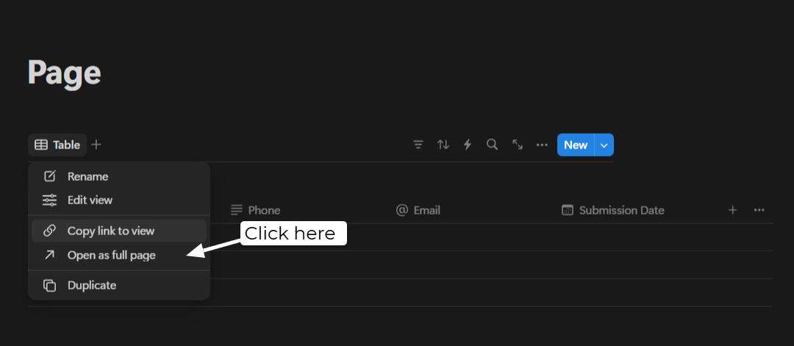
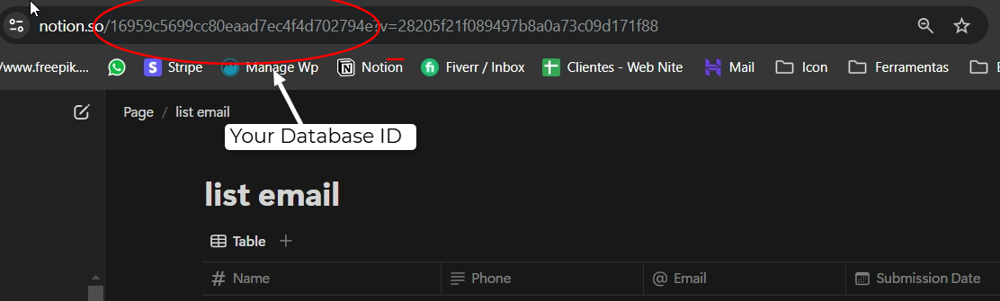

# TypeScript Form with Notion Integration

## How to Change Button Links and Texts

To change links or texts, follow these steps:

1. Go to the `public` folder of the project.
2. Press `Ctrl + F` to open the search function.
3. Search for the link or word you want to change.
4. Click "Replace" to make the substitution.

## How to Make More Advanced Modifications on the Website

For deeper modifications, follow these instructions:

1. Log in to the Framer account using the credentials below.
2. Make the desired changes in the Framer editor.
3. Click "Publish" to save the changes.
4. Go to [web2zip.ru](https://web2zip.ru/), paste the Framer website URL, and download the HTML.
5. Copy the downloaded HTML and paste it into the `index.html` file of the project.

## How to Set Up Notion Integration

1. Create a page in Notion.
2. Add a database table.
3. Create the following columns:
    - Name (The title of the database will be the person's name)
    - Phone (text format)
    - Email (email format)
    - Submission Date (date format)
4. Copy the column ID and paste it into the `.env` file in the "NOTION_DB" field.
5. Open [Notion Integrations](https://www.notion.so/my-integrations).
6. Create a new integration and paste the Internal Integration Secret Key into the `.env` file in the "NOTION_SECRET" field.

### How to Copy the Database ID:

